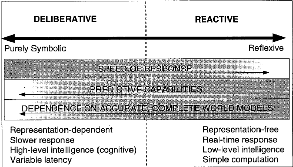

# Topics

## 1 Embodied artificial intelligence and design principles of autonomous agents

### Embodied artificial intelligence

#### The idea of artificial brains

- Wiener, Turing, Neumann, McCulloch - The fathers of computer science
- "You can make computers that can simulate brain functions"

#### Shakey - SRI - 1966 - 1972

- Charles Rosen, project initiator (It shakes a lot when moving, let's call it Shakey)
- First robot to **embody artificial intelligence**
- First mobile intelligent robot (Mobile Automaton)
- Numerous breakthroughs
  - Robotics
- Great grandfather of selv driving cars
- Primitive hardware

- Artificial Intelligence was a greenfield when Shakey started
- The components to Artificial Intelligence were being built
- Nobody had tried to integrate all of these components of AI and Robotics together before Shakey
- Shakey could reason about the world and sense the world and take actions

- The concept of an intelligent robot was limited to the realm of fiction
- Hardware:
  - TV Camera
  - Antenna radio link
  - Bump detectors
  - Push bar to move objects

#### Steve Collins 2005

Passive-dynamic walking robot that used gravity to walk human-like down a slope

### Design principles of autonomous agents

If you only look at the control, you have absolutely no way of understanding the behavior, you have to understand how the control is embedded into the physical system, and the dynamics of the physical
system.

Acting leads to sensing

<https://www.youtube.com/watch?v=mhWwoaoxIyc>

By Rolf Pfeifer

- These design principles were the first step towards a theory of intelligence
- It was not a recipe on how to effectively make good engineering designs

- Example: Building a robot for collecting ping pong balls:
  - Vacuum (Effective, but no behavioral diversity, no scientific value)
  - Embodied AI Approach (Ineffective, but it has behavioral diversity, and scientific value)

#### Overview

The **behavior is defined** as not alone by its control, but by a **combination of control, morphology, and environment**.

Morphology: shape and materials

Pfeifer's eight design principles

1. The **Task-Agent-Environment** Triangle
2. The **Complete** Agent Principle: Autonomous, Self-sufficient, Embodied (has actuators and sensors), Situated (views the world from its perspective)
3. **Parellel**, loosely coupled processes
4. **Sensory-motor coordination**: Behavior is directly guided by sensory input
5. **Cheap** design
6. **Redundancy** principle
7. Ecological **balance** - Complecities should be balanced (hardware, software)
8. **Value** principle - System should be judgeable what it is good for

## 2 Behavior-based robotics

- Behavior is determined by control, morphology and interactions with environment.
- Behavior is emergent from interaction between robot and environment
  - Deterministic control leads to non-deterministic behavior (no precise predictions)
  - Balance between body and brain complexity (small brain in simple robots)

### Behaviors

In behavior-based control, **behavior** refers to the **internal mechanisms** of the agent that determine its actions. Behaviors are **building blocks** that can be combined. They can be active or inactive

Sun seeker or avoider robot, sensors coupled directly to the motors.

- Keep them simle
- Keep them reactive (sensor motor coordination, no state), tightly couple perception and action
- Different behaviors are largely independent, runs in parallel
- Discrete: IFTTT
- Continuous: PID

### Behavior coordination

- **Priority-based coordination**:

  - Behaviors are ranked by manual priority
  - Pros: Simple, Cons: May scale poorly with many layers of behaviors

- **Action-selector coordination**: Behavior with highest response is selected
- **Voting-based coordination**: Behaviors vote on action. The action with the most votes is selected
- **Fusion-based coordination**: Behaviors are combined into a single action, e.g. vector addition

You want to incrementally add new behaviors

### Behavior based robots

- Sense $\rightarrow$ Model $\rightarrow$ Act $\rightarrow$ Plan $\rightarrow$ Act

### Kismet Behavior system

- Modeling infant behavior using perceiton and motivations
  - People perception, toy perception
  - Soical, fatigue and stimulation drives
- Uses Cross Exclusion groups for competitive behavior coordination
- Kismet has an attention system (Low level feature detection)

- Kismet is an example of a behavior-based robot beyond trivial examples
- Kismet exhibits several aspects of infant level behavior

- Relying on stimuli from the external world produces flexible and robust dynamic behavior

### Behavior-based control

- Pros:

  - Easy to extend (due to incremental approach)
  - Low development complexity (behaviors can be isolated and tested independently)
  - Robuts, real-time, reactive behavior
  - Behaviors do not changed once developed

- Cons: Hard to predict (emergent behavior)

### Roomba behavior

- Spiraling
- Wall following
- Room crossing
- Dirt detection

### Roomba hardware

- Cliff: Infrared in the bottom (distance)
- Virtual Wall/Home base: Infrared receiver on top
- Wall: Infrared on the side (distance)
- Wheel drop: Mechanical switch (wheel of the ground)
- Bump: Mechanical switch (collisions)
- Odometry: Encoders (wheel rotations)
- Dirt: acoustic impact sensor (noise)

### Frame of reference problem

- **Perspective** issue:
  - The robot's perspective is different from the designer's perspective
- **Behavior-versus-mechanism** issue
  - Behavior is more than internal mechanism, it is the result of robot-environment interaction
- **Complexity** issue
  - Complex behavior does not necessarily require complex mechanisms (emergence)

### Emergence

- **Emergence** is the process of complex pattern formation from simple rules (flocking)
- **Emergent behavior** is the behavior of the system as a whole that cannot be predicted from the behavior of its parts
  - Emergent behavior is robust to disturbances
  - Biological mechanisms are often emergent

## 3 Experimental methods in robotics

- **Experimental robotics** are critical for a ny project work
- Goal: Aquire new real-world knowledge that othet people can **use** and **trust**

- Which assumptions were made about the experiment
- Are the evaluation criteria explicit?
- What is being measured and how?
- Does the methods and measurements match the criteria?
- Is there enough information to reproduce the experiment?
- Does the system give a fair and realistic picture of the system being evaluated?
- Are the drawn conclusions precise and valid?

### Demonstrators

- **Demonstrators** are robots that are used to demonstrate a concept or a technology
  - Good demonstrators: Prototypes, pilot studies, proof of concept, inspirational
  - Bad demonstrators: No information, random results, irrelevant, dangerous, misleading

## 4 Hierarchical and hybrid control architectures

### Hierarchical architectures (GOFAI / Symbol based paradigm / Deliberate architectures)

- Build a tower of coffee cups
- STRIPS planner:
- IF(SAFE) THEN IDLE

### State-based representation

- State diagrams (finite state machines)
- Good representation: Complete (all possible states covered), Consistent (no illegal states), Consise (few states), Formal (a computer can understand it)

- Sokoban - Search tree

### Symbol-based VS Embodied

| Symbol-based          | Embodied                  |
| --------------------- | ------------------------- |
| Knowledge-based       | Knowledge-free            |
| Global view           | Local view                |
| Knowledge is required | Knowledge is not required |
| Centralized control   | Greedy choices            |

### Hybrid control architectures

Hybrid systems utilize both control approaches and glue them together.

You get the best of both worlds



### AuRA - 1985 - R.C. Arkin

## 5 Simulation and reality gap

Pros:

- Abstraction gives focus
- Faster and cheaper to develop
- Enables machine learning / big data

Cons:

- Reality gap (you might forget the complete problem)
- Difficult to model morphology between environment and robot
- Assumptions

### Simulation

```python
def step(state, action):
  # calculate next state
  return next_state


current_state = initial_state
while True:
  action = controller(current_state)
  next_state = step(current_state, action)
  current_state = next_state
```

Simulation consists of

- Physical model (logical, kinematic, dynamics)
- Sensor model
- Visualization

We use physics to simulate the robot.
We use visualization to inspect, debug and repurt results.

Simulator and visualization should be decoupled, so they can be run independently.

We can either use plots or 2D/3D visualization.

We need to simulate sensors.

For cameras, we can use the visualization to simulate the camera and feed it to the controller.

Real world is noisy, so we need to add noise to the simulation.

Simulatoters should not be used, if the task or environment too complex.

## 6 Sensors and image processing

### Sensors

- **Sensors** are the eyes and ears of the robot
- It is important to have redundancy in sensors, to avoid being overreliant on a single sensor
- It is important to calibrate the sensors, to ensure that they are accurate
- We can plot the respones in a controlled experiment

- Types of sensors:

  - Infrared sensors
  - Ultrasonic sensors
  - Bump sensors
  - Photoresistors
  - Cameras

- Proprioceptive sensors: Sensors that measure the internal state of the robot
- Exteroceptive sensors: Sensors that measure the external state of the robot

Many of these sensors return a simble binary or analog value.

However, cameras return a 2D image, which needs to be processed.

### Image processing

We want to extract information from the image. One way of doing this is using color segmentation (masking) and contour detection.

We can use OpenCV to process images.

We start by downscaling the image, to reduce the processing needed.

We then blur the image, to reduce noise and color differences. This is done using filtering, where we use a kernel that samples pixels around it and calculates the average. This can be done using gaussian blur, where the kernel is a gaussian function.

We then convert the image to HSV color space, to make it easier to detect colors. This is useful because the HSV color space separates the color information from the intensity information, which makes it robust to changes in lighting

If we want to detect a certain color range in the image that describes our object, we can use a color range to mask the image and then find contours.

In the course, we demonstrated this with a tennis ball.

In the exam robot, we used this to detect the blue or red LEDs on the Thymio robots.

## 7 Localization

- **Localization**: estimating the location of the robot in the environment.
- **Mapping**: creating a map of the environment.
- **Simultaneous localization and mapping (SLAM)**: estimating the location of the robot and creating a map of the environment at the same time.
- **State estimation**: estimating the velocity, angle, position, etc. of the robot.

### Problems

- Sensor errors
- Proprioceptive sensors (odometry) are not perfect
- Exteroceptive sensors (camera, lidar) are not perfect
- Computationally expensive
- Environment might be featureless
- The robot might be lost (unknown starting point)
- Landmarks might get confuzed with eachother

We can measure the odometry of the robot (the distance it has traveled), and see how the detected landmarks move over time. This can help us estimate the location of the robot and the landmarks.

We can't run our SLAM algorihm on all the data available, so we sample the data to reduce the computational cost.
We can use a discretized space (grid-based representation) to reduce the computational cost.

Landmarks are easier for providing instructions.

### Belief representation

We can represent the belief of the robot using a probability distribution.

### Monte Carlo localization

To estimate the location of the robot, we can use a particle filter. This is a Monte Carlo method, where we sample the space with particles and update the particles based on the sensor data.

1. Create X random particles
2. Move the particles based on the odometry
3. Keep the particles that are consistent with the sensor data
4. Resample the particles

### Landmarks

We can use landmarks to localize the robot. Landmarks are objects such as walls, corners, specific textures etc. that we can use as reference points.

### Applications

- Roomba, Undersea, Mars rovers, Self-driving cars

## 8 Distributed robotics

- **Distributed robotics** is the study of multiple robots working together to achieve a common goal

- Some tasks cannot be solved by a single robot

  - Seismic activity monitoring
  - Search and rescue

- Design goals

  - Scalability: The system should be scale to increased number of robots
  - Robustness: Robust to robot/communication failures
  - Reliability: High probability of solving the task
  - Versatility: Ability to solve different tasks
  - Adaptability: Ability to adapt to a dynamic environment

- Control

  - Centralized (one server, one failure point), Decentralize (several leaders, multiple failure points) or distributed control (no leader, no failure point, but high communication overhead)

- Organization

  - Centralized: Hiearchy (like the military, chain of command)
  - Distributed: Flat hiearchy (cars in trafic)

- Communication
  - Point-to-point (1-1 robot comm),
  - Broadcast (1-many),
  - Local (nearby),
  - Sensing (observe and infer),
  - Stigmergy (phereomones)

### Multi-robot systems

- A pack of wolves or a colony of ants
- Collaboration between robots
- Alliance

Q: How do we achioeve collabo ration between robots in multi-robot systems?
A: Using extended behavior-based control with social influence

Q: How to we perform task allocation?
A: Using auction-based algorithms

#### Alliance architecture

ALLIANCE is an example of a multi-robot architecture

- Fully distributed, behavior-based architecture for heterogeneous multi-robot systems

- Low level behaviors: Obstacle avoidance
- Task solving behaviors:
- Motivation for solving tasks

  - Calculated by multiplying several factors: Impatience (increases over time, slowly if another robot is doing the task), Sensory feedback (is the task still needed), Activity suppression (is the robot already doing something), Impatience reset, acquiscence (is the robot willing to do the task)

- Example application: Hazardous waste cleanup mission

  - 3 robots locate two waste spills
  - Status periodically reported to the base station
    - Tasks:
      - Report progress
      - Move-Spill
      - Find-locs-wander
      - Find-locs-methodical

- This architecture automatically scales to the amount of robots

#### Task Allocation

- **Task allocation** is the process of assigning tasks to robots
- **Auction-based task allocation** is a method where robots bid on tasks. They calculate their own fitness for performing a task. Robot with the highest fitness wins the task.
  - Uses message passing for communication
  - An agent acts as an auctioneer and publishes atask
  - After some time, bidder with best fitness wins the task
  - Auctioneer monitor task progress and if sufficient progress is not made, the task is reauctioned

#### Applications of multi-robot systems

- Warehouse robots (Kiva)

### Swarm-robot system

- Lots of small simple robots
- In isolation, the robots are not very useful
- Usefulness is emergent from the swarm
- Autonomous situated robots
- Local communication
- Often homogeneous robots
- No explicit task assigment, collaboration is emergent
- Example: Ants finding shortest path using pheromones that evaporate over time

  - If food source runs out, ants stop following the path and pheromones evaporate -> ants stop going there
  - Communication and memory is implicit in the environment

- Example: Many robots transport an object towards a target

- Control system: Artificial neural network

### Modular-robot system

- Robot consist of self contained modules
- **Metamorphic**: Can be reconfigured, change its morphology
- Example: MTRAN III
  - Modules use magnets and latches to connect
  - A module consists of two parts, linked together by a hinge
  - Hinge can be operated using a motor

### Locomotion

- Control: Gait tables or Role-based control

## 9 Robot learning

- Online learning: Learning while the robot is operating
  - If we can reduce the parameter space
- Offline learning: Learning in simulation

  - If we have big data

- Supervised learning: Learning from examples
- Unsuperivsed learning: Learning from patterns in data
  - Clustering
  - Filter data
  - Detect anomalies
- Reward-based learning: Learning from interaction with the environment and given rewards

  - Offline if we have a simulator than can generate data
    - Evolutionary computation
  - Online if we have a small state-action space
    - Reinforcement learning

- Hybrids are also common
  - Unsupervised offline learning with unsupervised online learning
  - Supervised offline learning with unsupervised online learning

### Reinforcement learning in robotics

- Learn by trial and error
- Rewards / Punishments
- Goal: Maximize reward, minimize punishment

- Input: Set of states $S$ and actions $A$
- Reward function $R(s_1,a_1) \rightarrow number$
- Simulation/environment $step(s_1, a_2) \rightarrow s_2$

Problem: Thymio robot sensor and motor state explosion
Solution: An abstraction on top of these. Simplify the state space

- obstacle: left, right, front, none
- actions: left, right, forward, backwards

#### Reward function

- We have a reward function $Q$ that tells us how good a state-action pair is. It is this expected cumulative reward that we want to maximize.
- Include **internal** and **external** progress estimators

In reinforcement learning, the controller that selects an action is called the **policy**.

#### Q-learning

- **Q-learning** is a model-free reinforcement learning algorithm
- We learn the **Q-values** of the **state-action pairs**
- We update the Q-values using the Bellman equation
- **Exploitation** will quickly converge to a local optimum
- Boltzmann **exploration** can be used to have a probability of selecting a random action, but favoring the best action, to avoid local optima
- The $Q$-table contains the expected **cumulative reward** for each state-action pair
- This $Q$-table is our policy, that tells us which action to take in each state. It can be used as our robot controller.

- Problems: Own state may not be accurate, due to noise in sensors
- We might not be able to perceieve the whole environment

- Problem: Time is continous, but learning is a discrete process
- Solution: Discretize time into cummulative steps

##### Q-learning in practice

- Q-CON: Using a neural network to approximate the Q-values

## 10 Evolutionary robotics and neural networks

- Automatically design robot’s control (and morphology)
- Find better solutions than human designers are able to
- Increase autonomy since the robot can adapt to environment
- Long term dream of “artificial life” able to learn and evolve

- Long time scale, compared to robot learning

### Overview of evolutionary robotics

START

- Generate the initial population
- Compute fitness

REPEAT

- Selection
- Crossover
- Mutation
- Compute fitness

UNTIL population has converged
STOP

### Artificial neural networks

1. Feed-forward neural networks (perception)
2. Recurrent neural networks (memory)

#### Advantages of neural networks

- Biologically plausible
- Distributed, parallel and emergent
- Different levels of adaptation (evolution, development and learning)

- Provides a straightforward mapping from sensors to motors

- We typically evolve the connection weights
- We can also evolve the network topology
- We can also evolve the activation functions
- We can also evolve the learning rules, leasrning rates, etc.

- ANN controllers can handle symmetric scenarios using recurrent connections (memory)
- This makes it different from Braitenberg vehicles

### Co-evolution

- **Co-evolution** is the process of evolving two or more populations simultaneously
- **Competitive co-evolution** is when two populations compete against each other

### Problems with Evolutionary Robotics

- If task is too complex, fitness will be 0 and the robot will not evolve

Solutions:

1. Increase supervision (fitness for simpler tasks)

2. Start with a simpler task
3. Co-evolution might trigger a gradual increase in complexity

Problems with 1 and 2: Might guide the evolution in the wrong direction, might not be clear how .
to subdivide the task


### Designing a good fitness function

- As implicit as possible (few constraints) to allow for creativity
- As internal as possible (measureable by robot) to allow transference to reality
- As behavioral as possible (not internal mechanisms) to avoid frame of reference problem


